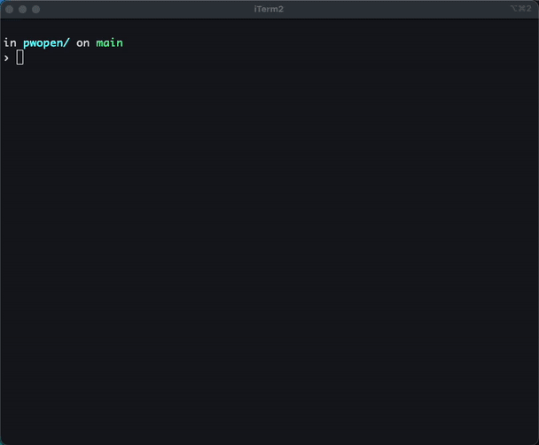

# pwopen

pwopen is a Playwright-based CLI tool that opens URLs and can render page screenshots directly in your terminal using Sixel graphics.

It allows for headless browsing, taking screenshots, and verifying page rendering without leaving your command line interface.



## Features

- Playwright Automation: Robust browser control using Chromium.
- Screenshots with Sixel: Optional Sixel screenshots in supported terminals (e.g., iTerm2, WezTerm, foot). Requires `sharp` and `sixel`.
- Secure: Chromium sandbox is enabled by default; in Docker you can keep it on with the provided seccomp profile.
- Configurable: Supports headed mode, sandbox options, and various runtime flags.

## Usage

### Via Docker (Recommended)

You can run `pwopen` directly from the GitHub Container Registry.

> Note: Sixel output is written to stdout. It will render in Sixel-capable terminals; a TTY is not required.
> For security, it is recommended to use the provided `seccomp_profile.json`.

Download the seccomp profile first:

```bash
curl -L -o seccomp_profile.json \
  https://raw.githubusercontent.com/hnw/pwopen/main/seccomp_profile.json
```

Command:

```bash
# Basic usage (open URLs; no screenshot output)
docker run --rm --init --ipc=host \
  --security-opt seccomp=./seccomp_profile.json \
  ghcr.io/hnw/pwopen:latest https://example.com

# With Sixel Screenshot enabled
docker run --rm --init --ipc=host \
  --security-opt seccomp=./seccomp_profile.json \
  ghcr.io/hnw/pwopen:latest --screenshot https://example.com

# Read URLs from stdin (extracts http/https from text)
printf 'https://example.com\n' | docker run --rm -i --init --ipc=host \
  --security-opt seccomp=./seccomp_profile.json \
  ghcr.io/hnw/pwopen:latest

```

_If you cannot use the seccomp profile, you may need to use `--cap-add=SYS_ADMIN` (less secure) or `--security-opt seccomp=unconfined` to allow Chrome to run. As a last resort, you can pass `--no-sandbox` (security trade-off)._

### Local Installation

Requirements: Node.js 18+

```bash
# Install dependencies
npm ci

# Install Playwright browsers (if not already installed)
npx playwright install

# Build the project
npm run build

# Run via CLI
node ./dist/main.js --screenshot https://google.com

```

## Options

| Option         | Description                                |
| -------------- | ------------------------------------------ |
| `--headed`     | Show browser window (default: headless)    |
| `--screenshot` | Render a Sixel screenshot after page load  |
| `--full-page`  | Capture full page when taking a screenshot |
| `--sandbox`    | Enable Chromium sandbox (default: true)    |
| `--no-sandbox` | Disable Chromium sandbox                   |
| `-h, --help`   | display help for command                   |

## Environment Variables

pwopen reads configuration from environment variables.

| Variable                    | Description                         | Default   |
| --------------------------- | ----------------------------------- | --------- |
| `PWOPEN_TIMEOUT_MS`         | Navigation timeout in milliseconds  | `15000`   |
| `PWOPEN_VIEWPORT_WIDTH`     | Viewport width                      | `1280`    |
| `PWOPEN_VIEWPORT_HEIGHT`    | Viewport height                     | `720`     |
| `PWOPEN_USER_AGENT`         | Custom User-Agent string            | _(unset)_ |
| `PWOPEN_NAVIGATION_RETRIES` | Retry count for navigation failures | `0`       |
| `PWOPEN_RENDER_WAIT_MS`     | Extra wait after render settle      | `200`     |

## License

MIT
