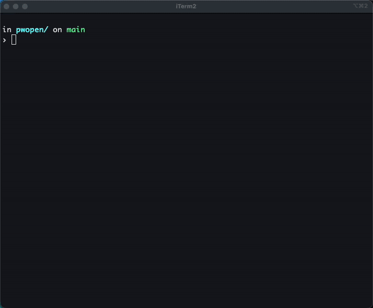

# pwopen

pwopen is a Playwright-based CLI tool that opens URLs and can render page screenshots directly in your terminal using Sixel graphics.

It allows you to perform headless browsing, take screenshots, and verify page rendering without leaving your command line interface.



## Features

- Playwright Automation: Robust browser control using Chromium.
- Screenshots with Sixel: Optional Sixel screenshots in supported terminals. Requires `sharp` and `sixel`.
- Secure by Default: The Chromium sandbox is enabled by default. When running in Docker, you can maintain this security using the provided seccomp profile.
- Configurable: Supports headed mode, sandbox options, and various runtime flags.
- Graceful Error Handling: Safely skips non-HTTP/HTTPS URLs and continues execution even if Sixel rendering fails.

## Prerequisites

- For Sixel screenshots: A Sixel-capable terminal (e.g., iTerm2, WezTerm, foot). Note that a TTY is not strictly required as the output is written to stdout.
- For Local Installation: Node.js 18 or later.

## Usage

### Via Docker (Recommended)

You can run `pwopen` directly from the GitHub Container Registry.

> Note: For security, it is highly recommended to use the provided `seccomp_profile.json` to keep the Chromium sandbox enabled inside the container.

Download the seccomp profile first:

```bash
curl -L -o seccomp_profile.json \
  https://raw.githubusercontent.com/hnw/pwopen/main/seccomp_profile.json

```

Commands:

```bash
# Basic usage (open URLs; no screenshot output)
docker run --rm --init --ipc=host \
  --security-opt seccomp=./seccomp_profile.json \
  ghcr.io/hnw/pwopen:latest https://example.com

# With Sixel Screenshot enabled
docker run --rm --init --ipc=host \
  --security-opt seccomp=./seccomp_profile.json \
  ghcr.io/hnw/pwopen:latest --screenshot https://example.com

# Read URLs from stdin (extracts http/https from text)
printf 'https://example.com\n' | docker run --rm -i --init --ipc=host \
  --security-opt seccomp=./seccomp_profile.json \
  ghcr.io/hnw/pwopen:latest

```

> Note: Standard input accepts a maximum of 10MB of text.
> Troubleshooting: If you cannot use the seccomp profile, you may need to use `--cap-add=SYS_ADMIN` (less secure) or `--security-opt seccomp=unconfined` to allow Chrome to run. As a last resort, you can pass the `--no-sandbox` flag to the tool (security trade-off).

### Local Installation

```bash
# Install dependencies
pnpm install

# Install Playwright browsers (and system dependencies)
pnpm exec playwright install --with-deps chromium

# Build the project
pnpm run build

# Run via CLI
node ./dist/main.js --screenshot https://google.com

```

## Options

| Option         | Description                                |
| -------------- | ------------------------------------------ |
| `--headed`     | Show browser window (default: headless)    |
| `--screenshot` | Render a Sixel screenshot after page load  |
| `--full-page`  | Capture full page when taking a screenshot |
| `--sandbox`    | Enable Chromium sandbox (default: true)    |
| `--no-sandbox` | Disable Chromium sandbox                   |
| `-h, --help`   | display help for command                   |

## Environment Variables

pwopen reads configuration from environment variables.

| Variable                    | Description                         | Default   |
| --------------------------- | ----------------------------------- | --------- |
| `PWOPEN_TIMEOUT_MS`         | Navigation timeout in milliseconds  | `15000`   |
| `PWOPEN_VIEWPORT_WIDTH`     | Viewport width                      | `1280`    |
| `PWOPEN_VIEWPORT_HEIGHT`    | Viewport height                     | `720`     |
| `PWOPEN_USER_AGENT`         | Custom User-Agent string            | _(unset)_ |
| `PWOPEN_NAVIGATION_RETRIES` | Retry count for navigation failures | `0`       |
| `PWOPEN_RENDER_WAIT_MS`     | Extra wait after render settle      | `200`     |

## License

MIT License
